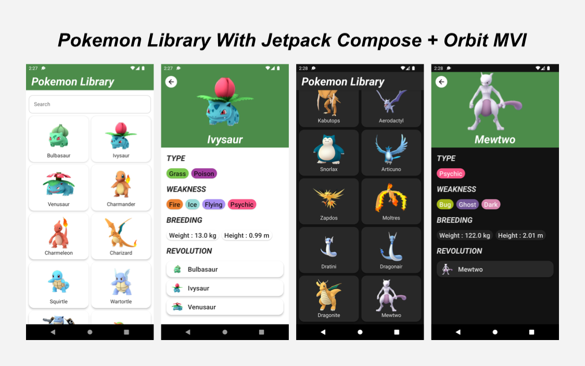
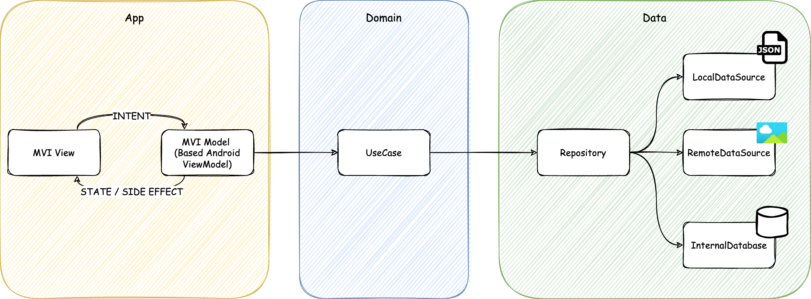

# Pokemon Library with Jetpack Compose

This repository contains a Pokemon Library application that is implemented MVI architecture using
Koin, Jetpack Compose, Navigation Compose, Orbit MVI.



## ✨Features

This application has next features.

- Display pokemon image and type, weakeness, breeding, evolutions.
- Search pokemon.
- Download pokemon character images.

## 🏢Architecture

This application is implemented by MVI architecture based on MVVM + Repository Pattern.



## 📦Module

This application has multi modules. For details of each module, please refer to the figure below.

| Name   | Details                                                      |
| ------ | ------------------------------------------------------------ |
| app    | Implement application user interface and navigation management logic. |
| domain | Implement business logic for Pokemon Library                 |
| data   | Define persistence data structure and implement persistence logic. |

## 📚Library

This application uses the libraries below.

| Name                  | Link                                                         |
| --------------------- | ------------------------------------------------------------ |
| Koin                  | https://insert-koin.io                                       |
| Jetpack Compose       | https://developer.android.com/jetpack/compose                |
| Navigation Compose    | https://developer.android.com/jetpack/compose/navigation     |
| Orbit MVI             | https://orbit-mvi.org                                        |
| Coil                  | https://coil-kt.github.io/coil/                              |
| Room                  | https://developer.android.com/training/data-storage/room?hl=ja |
| Kotlin-Serialiazation | https://github.com/Kotlin/kotlinx.serialization              |
| PokemonGO-Pokedex     | https://github.com/Biuni/PokemonGO-Pokedex                   |

## ⭐Reference

| Name                                                         | Link                                                         |
| ------------------------------------------------------------ | ------------------------------------------------------------ |
| Koin \| Jetpack Compose                                      | https://insert-koin.io/docs/reference/koin-android/compose   |
| Navigation Compose \| Navigating With Compose                | https://developer.android.com/jetpack/compose/navigation     |
| Orbit MVI \| Android ViewModel module                        | https://orbit-mvi.org/Android-ViewModel/overview             |
| MVI Architecture - Android Tutorial for Beginners - Step By Step Guide | https://blog.mindorks.com/mvi-architecture-android-tutorial-for-beginners-step-by-step-guide |
| Coil \| Jetpack Compose                                      | https://coil-kt.github.io/coil/compose/                      |

## 💡License

```
Copyright (c) 2022 Yusuke Katsuragawa

Permission is hereby granted, free of charge, to any person obtaining a copy
of this software and associated documentation files (the "Software"), to deal
in the Software without restriction, including without limitation the rights
to use, copy, modify, merge, publish, distribute, sublicense, and/or sell
copies of the Software, and to permit persons to whom the Software is
furnished to do so, subject to the following conditions:

The above copyright notice and this permission notice shall be included in all
copies or substantial portions of the Software.

THE SOFTWARE IS PROVIDED "AS IS", WITHOUT WARRANTY OF ANY KIND, EXPRESS OR
IMPLIED, INCLUDING BUT NOT LIMITED TO THE WARRANTIES OF MERCHANTABILITY,
FITNESS FOR A PARTICULAR PURPOSE AND NONINFRINGEMENT. IN NO EVENT SHALL THE
AUTHORS OR COPYRIGHT HOLDERS BE LIABLE FOR ANY CLAIM, DAMAGES OR OTHER
LIABILITY, WHETHER IN AN ACTION OF CONTRACT, TORT OR OTHERWISE, ARISING FROM,
OUT OF OR IN CONNECTION WITH THE SOFTWARE OR THE USE OR OTHER DEALINGS IN THE
SOFTWARE.
```
